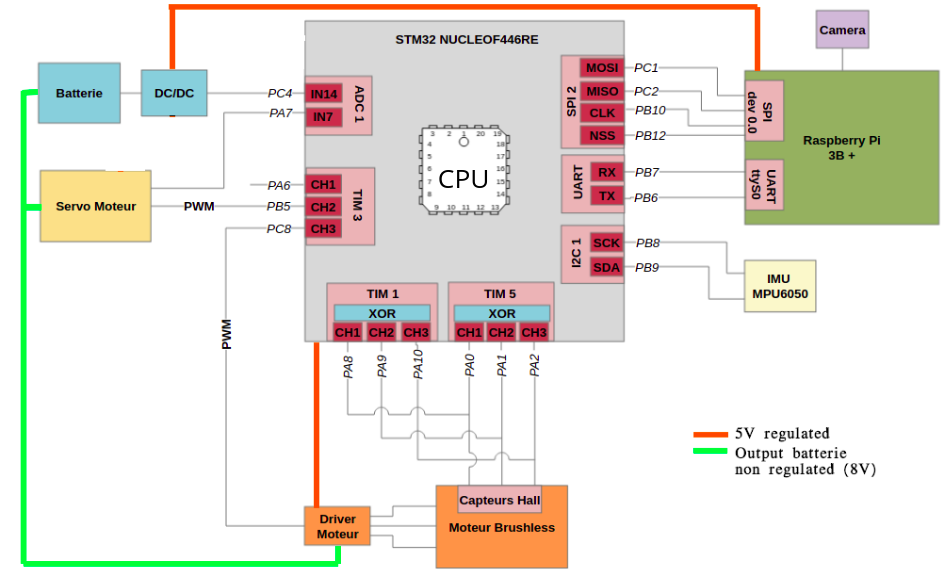
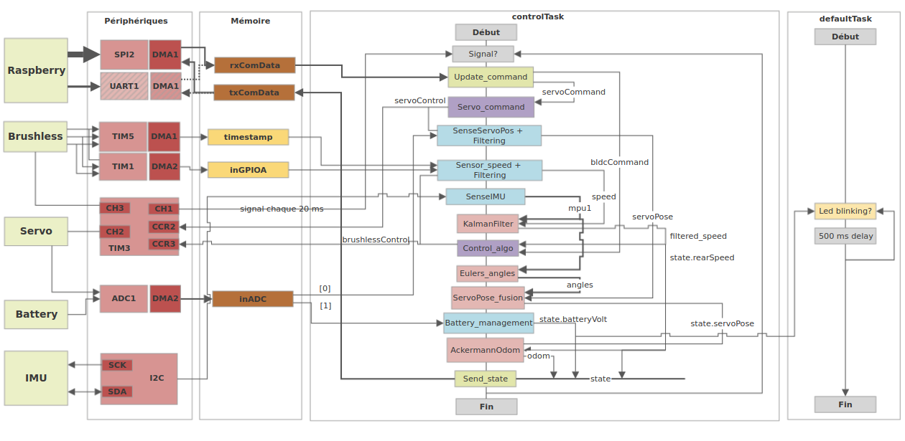

# Rover project
This repo gathers a significant part of the software developed to prepare a rover vehicule for hosting SLAM algorithms.
## MCU firmware
The rover_firmware folder contains all the programming of the used MCU to control the rover motors and construct its trajectory based on odometry.
Tools: C, Matlab, FreeRTOS, SystemView, CubeIDE, Kalman filtering, Ackermann steering, IMU sensor fusion, SPI, I²C, DMA, UART, ADC, PWM, Full state feed back control ...

The hardware architecture:

MCU software representation:

## ROS environnement
The goal of this section is to interface the MCU controller from a raspberry Pi connected to it via SPI. The raspberry pi should be able to command the mouvement of the rover and receive a synchronised odometry data from the MCU.
A ROS node is coded to do so and a rover description is made to be able to vizualize the rover in rviz and eventually run gazebo's simulation.

For further details, please refer to the slides:
https://docs.google.com/presentation/d/1Lh5SFXUTre3Tx0ith_qOZM8cdH3SMtDPEAFWdO35tQM/edit?usp=sharing
