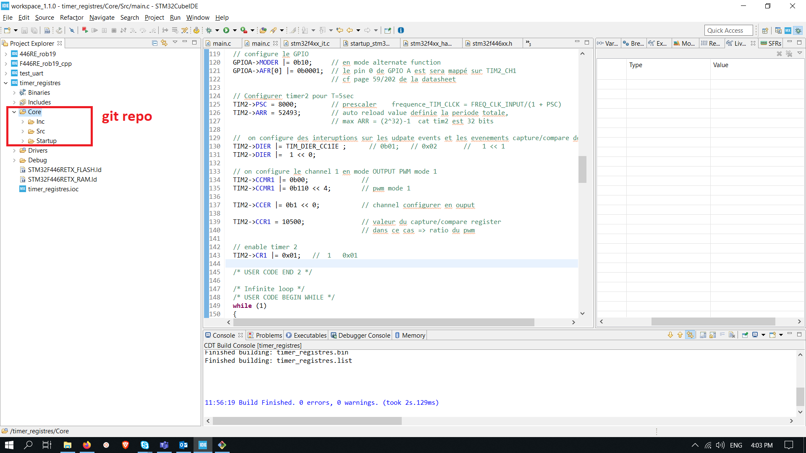

*Note:* The used target is Nucleo-F446RE. Portability of code to other STM32 targets should be tested. Bare metal programming of STM32F446RE peripherals maybe an issue for portability.

Assuming IDE used is Cube, this repo must be placed here:



* Navigate to the root of the project, and clone 

```
git clone ssh://git@gitlab.akka.eu:22522/Robotics-Line/rover-firmware.git Core
```
or 
```
git clone https://gitlab.akka.eu/Robotics-Line/rover-firmware.git Core
```

* Go in CubeIDE and generate code (Drivers etc) using .ioc file (rename it according to your project name). Once done feel free to build.

* For further details, please refer to the rover manuel  (Doc folder)
